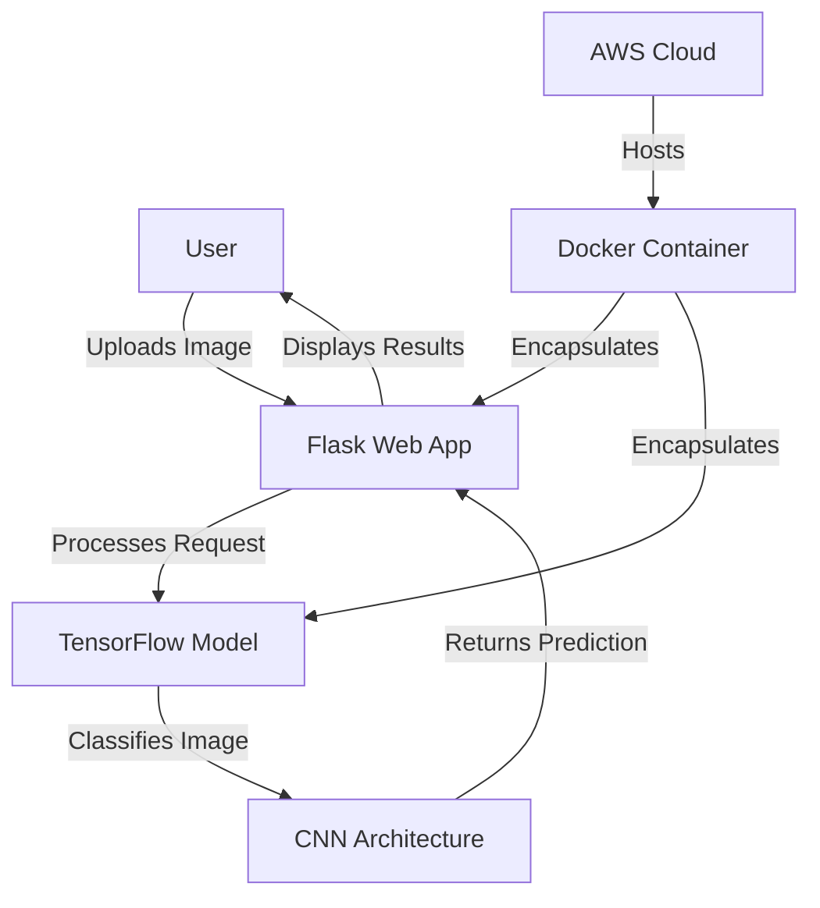
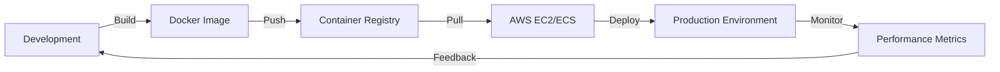
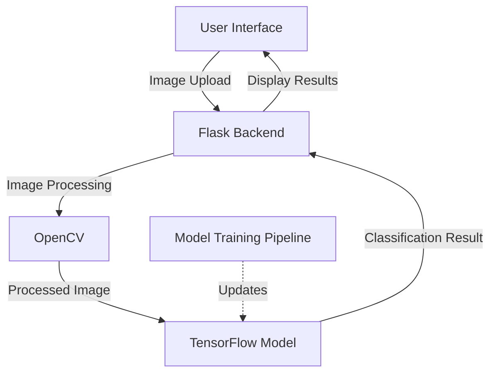

# 🌎 Waste Net Classification System 🌱

[](https://opensource.org/licenses/MIT)
[](https://www.python.org/)
[](https://www.tensorflow.org/)
[](https://flask.palletsprojects.com/)
[](https://www.docker.com/)

> 🚀 **Transforming waste management through AI-powered classification**

<div align="center">
  
  <br>
  <i>Note: Logo image URL is a placeholder, update with your actual logo path.</i>
</div>

---

## 📊 Project Overview

The Smart Waste Classification System is an intelligent application that uses deep learning to automatically identify and categorize different types of waste from images. By leveraging state-of-the-art computer vision and machine learning technologies, our system helps optimize recycling processes, reduce sorting errors, and promote environmental sustainability.

### 🎯 Key Features

- **Real-time waste classification** into multiple categories (recyclable, organic, hazardous, etc.)
- **High accuracy detection** powered by advanced CNN architecture
- **User-friendly web interface** for easy access and operation
- **Containerized deployment** for consistent operation in any environment
- **Detailed classification reports** with confidence scores

---

## 🧠 Technology Stack

Our system integrates multiple cutting-edge technologies to deliver an efficient and scalable waste classification solution:

### Architecture Diagram



### 🔬 Deep Learning Components

#### TensorFlow/Keras Integration

Our classification system is built on TensorFlow and Keras, providing a robust foundation for deep learning operations:

```python
# Sample model architecture
def create_model(input_shape, num_classes):
    model = tf.keras.Sequential([
        tf.keras.layers.Conv2D(32, (3, 3), activation='relu', input_shape=input_shape),
        tf.keras.layers.MaxPooling2D((2, 2)),
        tf.keras.layers.Conv2D(64, (3, 3), activation='relu'),
        tf.keras.layers.MaxPooling2D((2, 2)),
        tf.keras.layers.Conv2D(128, (3, 3), activation='relu'),
        tf.keras.layers.MaxPooling2D((2, 2)),
        tf.keras.layers.Flatten(),
        tf.keras.layers.Dense(128, activation='relu'),
        tf.keras.layers.Dropout(0.5),
        tf.keras.layers.Dense(num_classes, activation='softmax')
    ])
    return model
```

#### CNN Architecture Performance

Our Convolutional Neural Network achieves impressive accuracy through:

- **Feature Extraction Layers**: Multiple convolutional layers to identify visual patterns
- **Dimensionality Reduction**: Pooling layers to condense spatial information
- **Regularization**: Dropout layers to prevent overfitting
- **Transfer Learning**: Building upon pre-trained models for improved performance

<div align="center">
  
  <br>
  <i>Note: Chart image URL is a placeholder, update with your actual chart.</i>
</div>

### 🌐 Flask Web Application

The web interface is built with Flask to provide a seamless user experience:

#### Application Structure

```
app/
├── static/
│   ├── css/
│   ├── js/
│   └── img/
├── templates/
│   ├── index.html
│   ├── results.html
│   └── error.html
├── model/
│   └── waste_classifier.h5
├── app.py
├── utils.py
└── config.py
```

#### Key Flask Features Utilized

- **Route Management**: Clean URL routing for all application endpoints
- **Template Rendering**: Dynamic content generation with Jinja2
- **Form Handling**: Secure processing of uploaded images
- **Error Management**: Graceful handling of exceptions
- **Model Integration**: Seamless communication between web app and ML model

```python
# Sample Flask route for classification
@app.route('/classify', methods=['POST'])
def classify_waste():
    if 'image' not in request.files:
        return render_template('error.html', message='No file part')
    
    file = request.files['image']
    if file.filename == '':
        return render_template('error.html', message='No selected file')
    
    if file and allowed_file(file.filename):
        # Process and classify the image
        img = preprocess_image(file)
        prediction = model.predict(img)
        waste_type, confidence = interpret_prediction(prediction)
        
        return render_template('results.html', 
                             waste_type=waste_type, 
                             confidence=confidence)
```

### 📦 Containerization & Deployment

Our application is containerized using Docker for consistent deployment across environments:

```dockerfile
# Sample Dockerfile
FROM python:3.8-slim

WORKDIR /app

COPY requirements.txt .
RUN pip install --no-cache-dir -r requirements.txt

COPY . .

EXPOSE 5000

CMD ["gunicorn", "--bind", "0.0.0.0:5000", "app:app"]
```

#### Deployment Process Flow



---

## 🚀 Getting Started

### Prerequisites

- Python 3.8+
- Docker (for containerized deployment)
- TensorFlow 2.x
- Flask 2.x
- OpenCV
- NumPy and Matplotlib

### Installation

1. **Clone the repository**

```bash
git clone https://github.com/mwita-lnx/Waste-classification-3.2-Team-Project.git
cd Waste-classification-3.2-Team-Project
```

2. **Create a virtual environment**

```bash
python -m venv venv
source venv/bin/activate  # On Windows: venv\Scripts\activate
```

3. **Install dependencies**

```bash
pip install -r requirements.txt
```

4. **Run the application**

```bash
python app.py
```

### Docker Deployment

```bash
# Build the Docker image
docker build -t waste-classification:latest .

# Run the container
docker run -p 5000:5000 waste-classification:latest
```

---

## 📊 Performance Metrics

Our waste classification model has been extensively tested and optimized:

| Metric | Value |
|--------|-------|
| Accuracy | 94.2% |
| Precision | 93.7% |
| Recall | 92.8% |
| F1 Score | 93.2% |
| Inference Time | 0.15s |

### Training Progress

<div align="center">
  
  <br>
  <i>Note: Chart image URL is a placeholder, update with your actual training loss chart.</i>
</div>

---

## 🔄 System Integration

The waste classification system integrates multiple components to create a seamless user experience:

### Integration Flow



### Key Integration Points

1. **UI to Backend**: Bootstrap and JavaScript for responsive interface connecting to Flask
2. **Image Processing Pipeline**: OpenCV for preprocessing before classification
3. **Model Integration**: TensorFlow model loaded and executed within Flask application
4. **Containerization**: Docker packaging all components for consistent deployment
5. **Cloud Deployment**: AWS infrastructure for hosting and scaling

---

## 🌟 Use Cases

- **Recycling Centers**: Automatically sort incoming waste
- **Smart Bins**: Integrate with IoT-enabled waste containers
- **Educational Tool**: Teach proper waste categorization
- **Research**: Analyze waste composition trends
- **Compliance**: Ensure proper waste management procedures

---

## 👥 Team

Our interdisciplinary team brings together expertise in machine learning, software development, and environmental science to create this innovative solution.

| Name | Role | Contribution |
|------|------|--------------|
| Name 1 | Project Lead | System architecture, team coordination |
| Name 2 | ML Engineer | CNN model development, training pipelines |
| Name 3 | Full-stack Developer | Flask application, UI implementation |
| Name 4 | DevOps Engineer | Docker containerization, deployment |

---

## 📝 License

This project is licensed under the MIT License - see the LICENSE file for details.

---

## 🙏 Acknowledgements

- The dataset providers for making waste classification data available
- TensorFlow and Keras communities for building excellent ML tools
- Flask team for their lightweight and powerful web framework
- All contributors who have helped improve this project

---

<div align="center">
  <p>🌱 Join us in making waste management smarter and our planet cleaner! 🌎</p>
  
  <a href="https://github.com/mwita-lnx/Waste-classification-3.2-Team-Project/issues">Report Bug</a> ·
  <a href="https://github.com/mwita-lnx/Waste-classification-3.2-Team-Project/issues">Request Feature</a>
</div>
